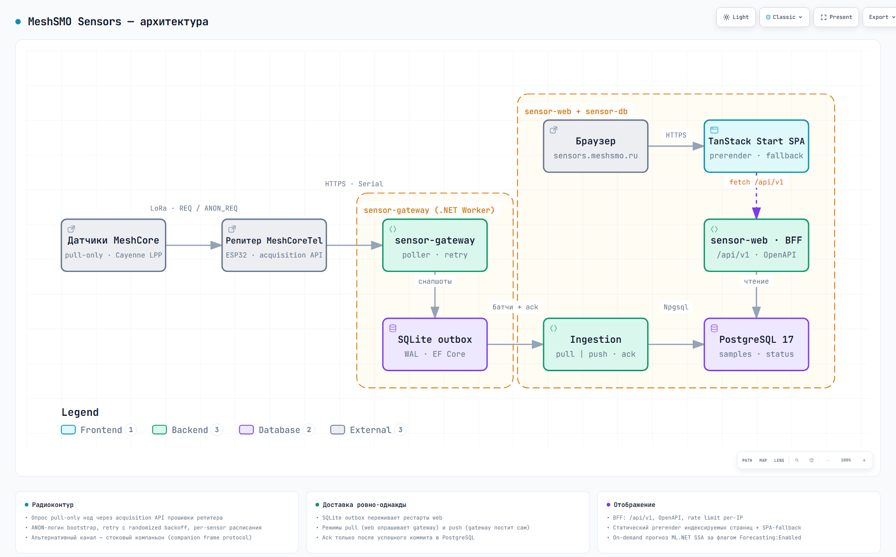

<div align="center">

# 📡 MeshSMO Sensors

**Сервис проекта MeshSMO: сбор, хранение и публичное отображение данных физических датчиков региональной mesh-сети в Смоленске и Смоленской области**

[](https://github.com/MeshSMO/MeshSMO.Sensors/actions/workflows/ci.yml)
[](https://github.com/MeshSMO/MeshSMO.Sensors/actions/workflows/codeql.yml)
[](https://github.com/MeshSMO/MeshSMO.Sensors/actions/workflows/release.yml)
[](./gitleaks.toml)

[](https://dotnet.microsoft.com/)
[](https://tanstack.com/start)
[](https://www.postgresql.org/)
[](https://github.com/orgs/MeshSMO/packages)

**[sensors.meshsmo.ru](https://sensors.meshsmo.ru/)**

</div>

---

MeshSMO Sensors — сервис проекта [MeshSMO](https://github.com/MeshSMO): он опрашивает подключённые к региональной mesh-сети физические датчики, сохраняет историю измерений и публикует её на сайте и через API — актуальные показания и статусы, графики, карта, агрегаты за большие интервалы, а по запросу прогноз, всегда отображаемый отдельно от измеренных значений.

## О MeshSMO

MeshSMO — некоммерческий проект вокруг независимой LoRa mesh-сети в Смоленске и Смоленской области. Сеть — это узлы и ретрансляторы, обменивающиеся радиопакетами по протоколу MeshCore; поверх неё развивается набор сервисов: карта сети, мониторинг инфраструктуры, документация и публичные данные датчиков.

MeshSMO Sensors — один из этих сервисов и отвечает только за датчики: их опрос, историю измерений и публичное представление.

## Что делает MeshSMO Sensors

Датчики, доступные через сеть MeshCore, периодически опрашивает gateway-сервис. Полученные измерения сохраняются и публикуются на сайте и через API:

- актуальные показания и статус каждого датчика;
- история измерений и графики — температура, влажность, давление, батарея и другие показатели;
- карта датчиков и диагностика радиоканала (RSSI/SNR);
- агрегированные данные за большие интервалы (min/avg/max);
- прогноз по накопленной истории — по запросу и всегда отдельно от измерений.

Публикуются только фактически полученные измерения. Агрегаты и прогноз помечаются как расчётные значения; пропуски в данных не заполняются и остаются пропусками.

## Как это устроено

Система собирает показания физических датчиков, отвечающих на mesh-запросы Cayenne LPP, складывает их в SQLite-outbox на gateway, доставляет в PostgreSQL (pull или push, ровно-однажды) и публикует через BFF `/api/v1/*` с SEO-оптимизированным статическим фронтом. Прогноз любой числовой метрики (ML.NET SSA с quality gate) строится on demand и в БД не сохраняется.

## Архитектура

<picture>
  <source media="(prefers-color-scheme: dark)" srcset="docs/assets/architecture-dark.png">
  
</picture>

:link: [Интерактивная версия](./docs/assets/architecture.html) — pan/zoom, трассировка связей, тёмная/светлая тема, экспорт в PNG/SVG.

Границы простые: **gateway не знает про PostgreSQL**, **web не знает про MeshCore**, **фронт не знает про LoRa** — только `/api/v1/*`.

| Компонент | Что делает |
|---|---|
| `sensor-gateway` | Единственный, кто общается с репитером (HTTPS / USB-serial / компаньон): панельная телеметрия (opt-in) и опрос датчиков по per-sensor расписаниям. Пишет в SQLite-outbox, отдаёт батчи по внутреннему API (pull) или сам доставляет в web (push) |
| `sensor-web` | ASP.NET Core BFF + TanStack Start SPA (статический prerender, без Node-рантайма): принимает батчи, пишет в PostgreSQL, отдаёт `/api/v1`, статику, sitemap/robots |
| `sensor-db` | PostgreSQL 17 — только для web и DbMigrator |
| `sensor-dbmigrator` | One-shot: EF-миграции + синк YAML-реестра датчиков в БД |

## Возможности

- 🔁 **Опрос pull-only нод** через acquisition API прошивки репитера: `POST /api/request` + ANON-логин bootstrap, due-time очередь, retry с randomized backoff, per-sensor расписания по времени суток (`polling.schedule` с IANA-таймзоной)
- 📦 **Надёжная доставка**: SQLite-outbox переживает падения web; pull- и push-режимы, идемпотентность по `(sensor_id, request_id)`, ack только после коммита в PostgreSQL
- 📊 **Публичный API**: список/детали датчиков, статусы, последние значения, история с `resolution=auto` (downsample min/avg/max, бюджет ~5k точек), дашборд-агрегат, OpenAPI на `/openapi/v1.json`, rate limit per-IP
- 🔮 **Прогноз on demand** (ML.NET SSA): rolling backtest против baseline, quality gate, горизонты 1–24 ч, флаг `Forecasting:Enabled` — модели и прогнозы в БД не хранятся
- 🗺️ **Фронт**: живой дашборд, страницы датчиков с графиками (recharts, зоны по значениям оси), карта нод, русская локализация
- 🔍 **SEO без SSR**: статический prerender индексируемых маршрутов из реестра + SPA-fallback, per-route canonical, JSON-LD, sitemap

## Быстрый старт

### Полный стек в Docker

```bash
git clone https://github.com/MeshSMO/MeshSMO.Sensors.git
cd MeshSMO.Sensors/deploy
cp env.example .env        # заполнить секреты (пароли БД/репитера, ключи API)
docker compose up -d --build
# web → http://localhost:8080
```

Вместо локальной сборки можно запустить опубликованные образы (нужен `docker login ghcr.io` для приватных пакетов):

```bash
docker compose -f deploy/compose.yaml -f deploy/compose.registry.yaml up -d
```

Порядок старта compose: `sensor-db` → `sensor-migrator` (миграции + синк реестра, one-shot) → `sensor-web` + `sensor-gateway`.

### Локальная разработка без Docker

Требуется .NET 10 SDK и Node.js 24 (фронт собирается через esproj автоматически).

```bash
dotnet tool restore
dotnet build MeshSMO.Sensors.slnx
dotnet test tests/MeshSMO.Sensors.UnitTests
```

BFF + Vite одной командой: SPA-proxy сам поднимет фронтенд на `http://localhost:5173`, Vite проксирует `/api` и `/health` в BFF на `:5200`:

```bash
dotnet run --project src/MeshSMO.Sensors.Web --launch-profile http
```

Фронтенд отдельно: `cd src/web && npm ci && npm run dev` (dev-сервер на `:5173`). Публичная проекция реестра (`src/generated/sensorRegistry.json`) генерируется на prebuild из `config/sensors/*.yaml`.

Прогнозный API выключен по умолчанию. Для локальной проверки после накопления достаточной истории:

```powershell
dotnet user-secrets set --project src/MeshSMO.Sensors.Web "Forecasting:Enabled" "true"
dotnet user-secrets set --project src/MeshSMO.Sensors.Web "Forecasting:MinimumHistoryDaysByHorizon:1h" "3"
dotnet user-secrets set --project src/MeshSMO.Sensors.Web "Forecasting:MinimumHistoryDaysByHorizon:6h" "3"
dotnet user-secrets set --project src/MeshSMO.Sensors.Web "Forecasting:MinimumHistoryDaysByHorizon:12h" "5"
dotnet user-secrets set --project src/MeshSMO.Sensors.Web "Forecasting:MinimumHistoryDaysByHorizon:24h" "7"
dotnet run --project src/MeshSMO.Sensors.Web --launch-profile http
```

Минимальная история настраивается отдельно для каждого горизонта через `Forecasting:MinimumHistoryDaysByHorizon`; `MinimumHistoryDays` используется как fallback для горизонтов без явной настройки.

> ⚠️ **Gateway локально трогает железо.** `dotnet run --project src/MeshSMO.Sensors.Gateway` шлёт реальный ANON-логин на репитер и может сбить сессию продового gateway. Для смоук-тестов отключите радио: `$env:MeshCore__Mode = "Disabled"`.

Валидация YAML-реестра без БД (используется и в CI):

```bash
dotnet run --project src/MeshSMO.Sensors.DbMigrator -- --validate-registry
```

## Конфигурация

Только переменные окружения (12-factor); полный аннотированный список — [deploy/env.example](./deploy/env.example), детали — спека §35. Ключевые:

```text
ConnectionStrings__Sensors=...                    # PostgreSQL (web, dbmigrator)
Registry__Directory=config/sensors                # YAML-реестр датчиков
MeshCore__Mode=Http|Serial|Companion|Disabled
MeshCore__Http__BaseAddress=https://192.168.1.123
MeshCore__Http__AdminPassword=...                 # пароль панели репитера
SensorPolling__LoginPassword=...                  # общий пароль нод (per-node — mesh.loginPassword в YAML)
Gateway__Mode=Pull|Push                           # доставка outbox (push: + Push__ApiUrl, ключи GATEWAY_*_API_KEY)
Forecasting__Enabled=false                        # прогнозный API
Forecasting__MinimumHistoryDaysByHorizon__24h=7   # минимум истории по горизонту (fallback — MinimumHistoryDays)
Public__BaseUrl=https://sensors.meshsmo.ru        # canonical/sitemap
```

Секреты в git не хранятся: реестр датчиков `config/sensors/*.yaml` gitignored (в репозитории только `schema.json`), пароли нод подставляются из env через `${VAR}`. Литеральный `$` в `deploy/.env` экранируется как `$$`.

## CI и релизы

- **CI** (`ci.yml`) — gitleaks по истории, .NET build + тесты (Release), фронт: lint + Prettier + typecheck + build, сборка трёх Docker-образов (в PR — без публикации). Каждый push в `master` публикует rolling-образы `ghcr.io/meshsmo/meshsmo-sensors-{web,gateway,dbmigrator}` с тегами `<ветка>` и `sha-<hash>` (amd64; gateway/dbmigrator ещё и arm64).
- **Release** (`release.yml`) — на теге `v*.*.*`: прогоняет CI как quality gate, публикует версионированные образы (`1.2.3`, `1.2`, `1`, `latest`) и создаёт GitHub Release.
- **CodeQL** (`codeql.yml`) — статанализ безопасности.

Релиз:

```bash
git tag v0.1.0
git push origin v0.1.0
```

## Документация

Полный индекс — [docs/README.md](./docs/README.md).

| Документ | О чём |
|---|---|
| [AGENTS.md](./AGENTS.md) | точка входа для агентов и новых разработчиков: структура, команды, найденные грабли, актуальный статус |
| [ARCHITECTURE.md](./ARCHITECTURE.md) | компоненты, потоки данных, мини-ADR, ограничения |
| [docs/specs/implementation-spec.md](./docs/specs/implementation-spec.md) | главная спека: требования, модель данных, SEO-стратегия, план фаз |
| [docs/specs/repeater-acquisition-spec.md](./docs/specs/repeater-acquisition-spec.md) | контракт прошивки репитера (acquisition + ANON-логин) |
| [docs/specs/forecasting-spec.md](./docs/specs/forecasting-spec.md) | прогнозирование: ML.NET SSA, quality gates, API |
| [docs/reference/wire-protocol.md](./docs/reference/wire-protocol.md) | wire-форматы: REQ/ANON, Cayenne LPP, payload'ы outbox |
| [CODESTYLE.md](./CODESTYLE.md) | правила кодстайла (warnings-as-errors) — читать перед C#-правками |
| [SECURITY.md](./SECURITY.md) | политика безопасности и сообщение об уязвимостях |

## Статус

MVP работает end-to-end на железе. Осознанно отложено (Phase 9/10 спеки): OTel/метрики, бэкапы + runbook, security headers/CSP, restore-drill и soak-тесты, авто-деплой на хост.
